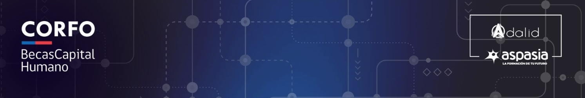

# Gestor de Notas con React 📝



Este proyecto es una **aplicación web para administrar y gestionar notas**, desarrollada con **React y Vite**. Permite a los usuarios crear, editar y eliminar notas de manera sencilla. La aplicación está diseñada para ser rápida, responsiva y fácilmente actualmente es **Progressive Web App (PWA)**, pero futuras actualizaciones aplicaremos el uso de **LocalStorage**.

## **📌 Características**

- ✅ **Crear, editar y eliminar notas** en una interfaz amigable.
- ✅ **Organización de notas** en un listado dinámico.
- ✅ **Diseño responsivo** para dispositivos móviles y escritorio.
- ✅ **Código modular y escalable** con componentes reutilizables.
- ✅ **Preparada para integrar localStorage, imágenes y geolocalización** (próxima implementación).

## **📁 Estructura del Proyecto**

```plaintext
├── README.md                  # Documentación del proyecto
├── eslint.config.js            # Configuración de ESLint para buenas prácticas
├── index.html                  # Archivo HTML principal
├── package.json                # Dependencias y scripts de la aplicación
├── public/
│   └── vite.svg                # Logo de Vite
├── src/
│   ├── App.jsx                 # Componente principal de la aplicación
│   ├── assets/                 # Recursos estáticos (imágenes, logos)
│   │   ├── logo.jpeg           # Logo del proyecto
│   │   └── react.svg           # Logo de React
│   ├── components/             # Componentes reutilizables
│   │   ├── NoteCard.jsx        # Componente para mostrar una nota individual
│   │   ├── NoteForm.jsx        # Componente para agregar/editar notas
│   │   └── NotesList.jsx       # Componente que muestra la lista de notas
│   ├── data/
│   │   └── notes.js            # Datos iniciales de las notas (simulación de DB)
│   ├── main.jsx                # Punto de entrada de React
│   ├── pages/                  # Sección para futuras páginas adicionales
└── vite.config.js              # Configuración de Vite para optimización
```

## **🚀 Instalación y Ejecución**

Para ejecutar la aplicación localmente, sigue estos pasos:

1. Clonar el Repositorio

```bash
git clone https://github.com/adalid-cl/ESPECIALIZACION_FRONTEND_M6_AE2
cd ESPECIALIZACION_FRONTEND_M6_AE2
```

2. Instalar Dependencias

```bash
npm install
```

3. Ejecutar la Aplicación

```bash
npm run dev
```

Luego, abre tu navegador y accede a **`http://localhost:5173`**.

## **🛠️ Funcionalidades de los Componentes**

- `NoteForm.jsx` - Formulario para Agregar y Editar Notas
  - Este componente permite a los usuarios ingresar nuevas notas y editarlas.
- `NoteCard.jsx` - Componente para Mostrar Notas
  - Cada nota se renderiza dentro de este componente.
- `NotesList.jsx` - Listado de Notas
  - Administra la lista de notas dinámicamente.

## Autores

- [Brayan Diaz C](https://github.com/brayandiazc)

Con ❤️ por [Adalid CL](https://github.com/adalid-cl) 😊
